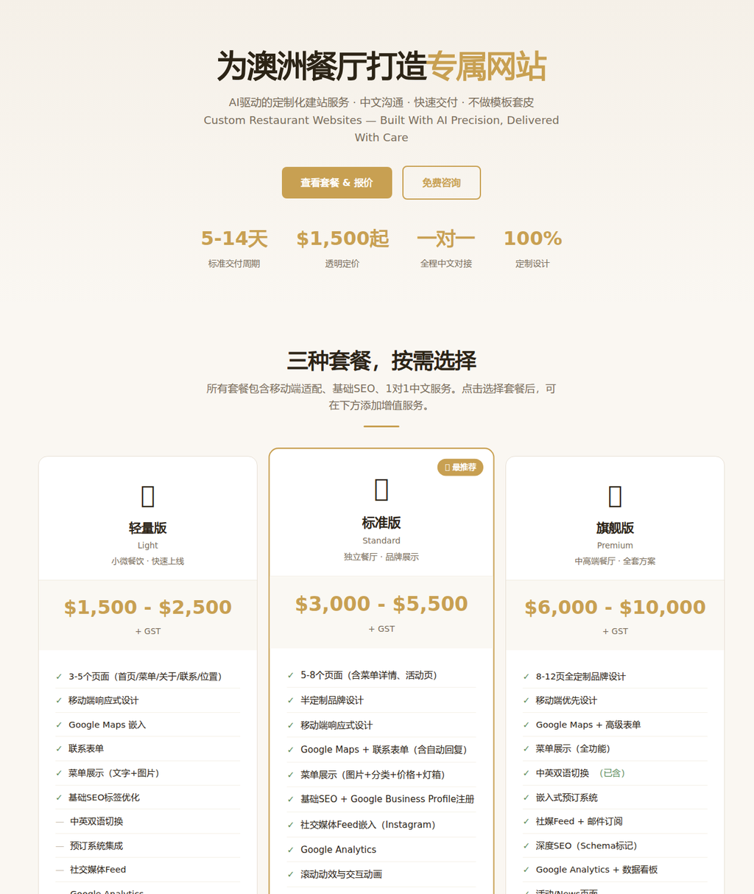

# Restaurant Website Service — Landing Page

Landing page for a boutique **restaurant website service** for independent Australian restaurants.

**Live:** https://12345666ddwa.github.io/restaurant-web-service/

## What's on the page

- **Three packages** ($1,500–$10,000) with clear scope: pages, bilingual support, SEO, booking & map integrations.
- **Add-on menu** and a **live quote calculator**.
- **Selected work** — Thirty 7even Dining (Sydney) and Chaozhou Malaya Bistro (Melbourne) — with links to the full case sites (also included in this repo under `thirty7even/` and `chaozhou_malaya/`).
- Engagement process (brief → quote → build → launch) and a contact form.

Design & build: Xing Gao.
